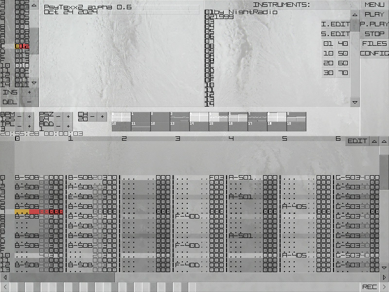
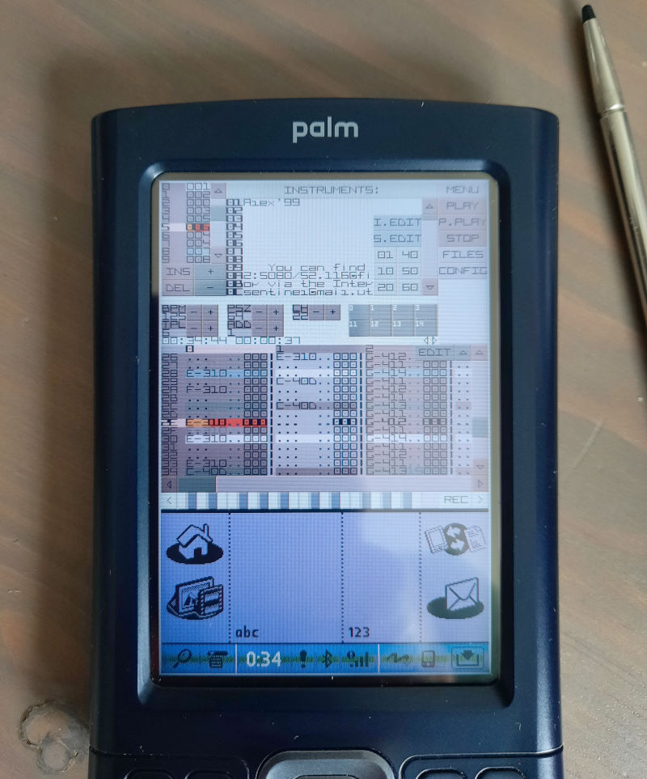

**PsyTexx 2** is a cross-platform music tracker based on the XM (FastTracker eXtended Module) format.  
It is available for Linux (including text console mode), Windows and PalmOS.  

PsyTexx 2 is a logical continuation of PsyTexx 1.x, but with a new sound engine based on the XM format.  
In 2007, the project was frozen due to the start of the SunVox development.  
In 2024, i decided to make some changes and fix some bugs in the PsyTexx code so that it could be built on modern platforms.

Non-standard (available only in PsyTexx) XM features:
* each channel contains subchannels: instruments with a long envelope can continue to sound after NOTE OFF - this option can be enabled in the instrument editor;
* stereo sample support;
* effect I0 - sample play mode: 0 - normal; 1 - back direction; 2 - pause;
* effect I1 - channel option: reduce sampling frequency;
* effect I2 - channel option: reduce number of bits;

Not implemented:
* UTF-8 support;
* instrument envelope editor;
* the mouse drag event support in the console version - this code exists but for some reason it doesn't work.

Source tree structure:
* BIN - compiled versions, config file, background and font images;
* DOCS - documentation;
* MAKE - build scripts;
* MUSIC - some of my music in the XM format;
* core - base includes;
* file - file management;
* log - log management;
* memory - memory management;
* psynth - PsyTexx modular synth engine in early development; it later became SunVox;
* psytexx - PsyTexx main and UI;
* sound - sound output;
* time - time management;
* tiny_jpg - JPG loading;
* wm - window manager (UI base);
* xm - XM playback engine;

Screenshots:

Please support my work:  
https://warmplace.ru/donate
